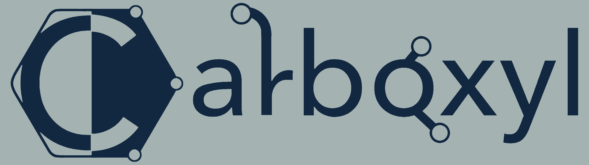

Carboxyl is a set of opinionated styles and themes for QML, designed from the ground up to iterate upon existing UI design suites and implementations. More specifically, Carboxyl contains:
- Custom styles
- *Clover*
- Compatibility shims for newer features
  * Carboxyl is regularly tested on Qt 6.8 and above, but contains shims that *should* guarantee compatibility as low as 6.2
- Custom component functionality

Currently, Carboxyl is in a WIP state with no ETA for release.

## Clover

Clover is the internal name for Carboxyl's custom theming engine. Clover leverages the existing `QQuickPalette` engine, but extends upon it by:
- Defining *context switch* operations
- Providing opinionated default themes (Light, Dark, Midnight/OLED)
- Defining accents separate from the main themes
- Passing light/dark mode status to the styling engine

## Usage

Carboxyl is designed to be roughly *plug-and-play* via the use of `CarboxylApplication`. Some components differ; notably `Dialog`/`NativeDialog`, `CarboxylTab{Button,Bar}`, etc; this will be documented soon. For now, see the reference demo application in `Carboxyl/Demo` for information on linking, theme/style selection, and general usage patterns.

## Styles

Carboxyl comes with 5 styles, with more to come soon.

TODO add screenshots and elaborate?

### Graphide

Graphide is a style based off of Qt's FluentWinUI3 platform. It is designed to create a bubbly, rounded feel with proper accenting, *without* taking up lots of space or creating unusable touch targets.

* Graphide is fully compatible with Qt versions prior to 6.7, unlike FluentWinUI3.
* While Fluent design was used as a reference, the implementations themselves are largely derived from Helios.

### Helios

Helios is a style based off of Google's Material Design guidelines. It is designed to create a bubbly, rounded feel with proper accenting, focusing on large touch targets and creating a universal UX flow between touch and desktop targets.

* Carboxyl reimplements many internal implementation details compared to Material (notably, many effects have been rewritten/simplified). As such, Helios will look and act dramatically different than the standard Material style.

### Hydrogen

Hydrogen is a style based off of Microsoft's Universal Design guidelines. It is designed to create a sleek, flat, desktop-oriented feel, mimicking the typical look & feel of a traditional Windows desktop.

* Carboxyl's primary changes to Hydrogen are found within its paletting.

### Trioxide

Trioxide is a style based off of Qt's Fusion style and KDE's design guidelines. It is designed to create a sleek, flat, desktop-oriented feel, mimicking the typical look & feel of a traditional Linux desktop.

* Many controls within Fusion are inadequate, don't follow proper theming, or just look bad. Trioxide intentionally reimplements large parts of the Fusion library for the sake of flexibility.

### Basalt

Basalt is a minimalist design style, based off of Qt's Basic style. It is designed to create a sleek, flat, desktop-oriented feel, taking up as few resources as possible while maintaining a proper look & feel.

* Basalt takes some inspiration from Graphide and Hydrogen.

### Ace (WIP)

Ace is a style based off of Microsoft's Aero Design guidelines, as well as Apple's Liquid Glass design philosophy. It is designed to create a glassy, bubbly feel, akin to Windows Vista and 7, *without* sacrificing readability or UX.

### Camphor (WIP)

Camphor is a unique style created by crueter. It is designed to be compact and flat, while maintaining a mobile-oriented look & feel.

### Cysteine (WIP)

Cysteine is a unique style created by crueter, based off of the Helios style. It is designed to define the bare minimum boundaries and layouts necessary to maintain clarity of its components.

### Tropic (WIP)

Tropic is a style based off of Apple's Aqua Design guidelines. It is designed to create a colorful, rounded, and translucent look & feel.

TODO:
- {Scroll,Split,Stack,Swipe}View
- GroupBox?
- ApplicationWindow
- Frame
- Page
- HeaderViews
- ToolBar
- Delegate types
- Indicator types
- TextArea
- Tumbler
- Menus
- Drawer
- Popups
- ToolTip
- Separators
