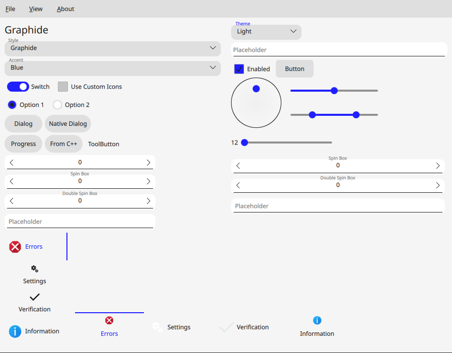
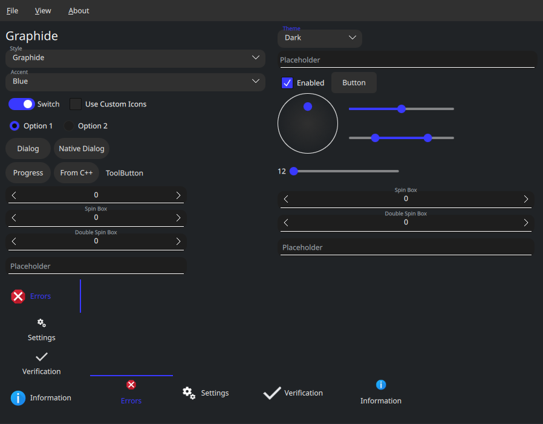
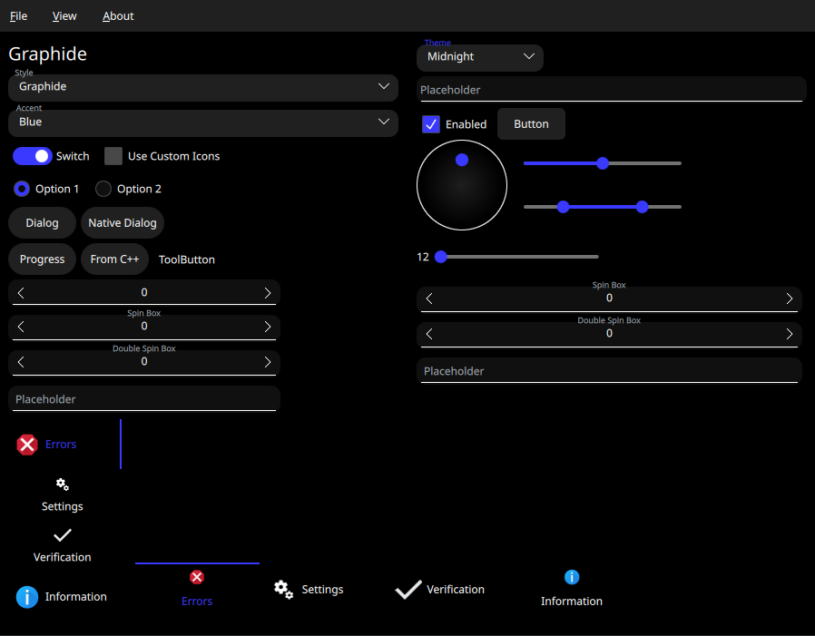

# Themes

Clover provides a default set of 3 themes: Light, Dark, and Midnight.

## Creating Custom Themes

First, you must define a theme. This is done with the `CloverPalette` class. The `CloverPalette` class contains:

- `name`: A descriptive identifier used for the theme
- `currentAccent`: A pointer to the current Clover accent
  - Clover accents are split into light, dark, and midnight colors, though you may define your own if you wish.
  - Typically this will look something like `currentAccent: Clover.accent.dark`
- `active`: Standard palette
- `inactive`: Palette used when the application is out of focus
- `disabled`: Palette used when the control is disabled

`active`, `inactive`, and `disabled` are all standard QML `ColorGroup`s.

You're highly recommended to start from one of the pre-existing palettes and modify them as needed. You may find their definitions in [`Clover.qml`](../Carboxyl/Clover/Clover.qml). Take special note of the `CarboxylAlwaysActive` handling!

### Registration

Once you've completed your theme, you must register it with Clover. To do so, call `Clover.registerTheme(myTheme)` (e.g. in a `Component.onCompleted` block), and it should now show up in a combo box that references `Clover.themes`!
